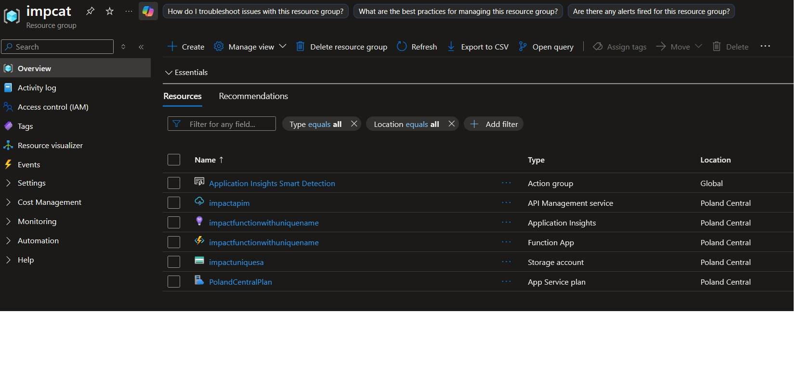
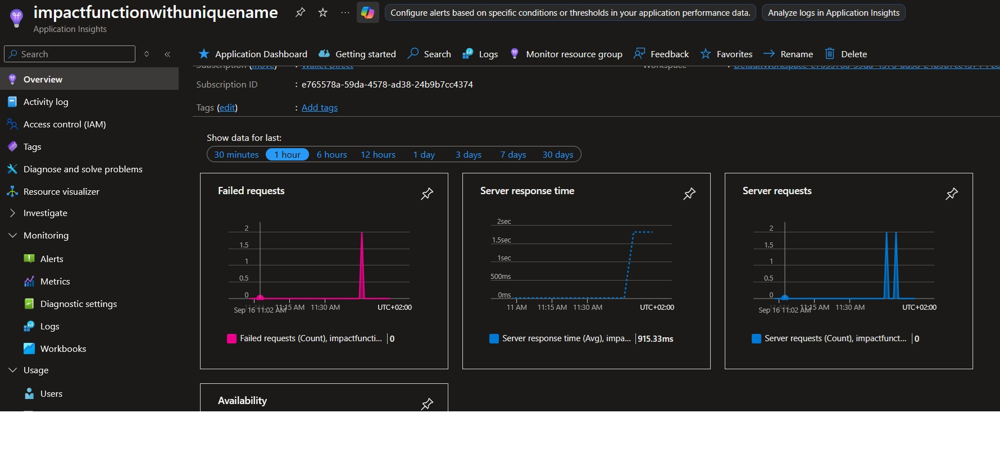
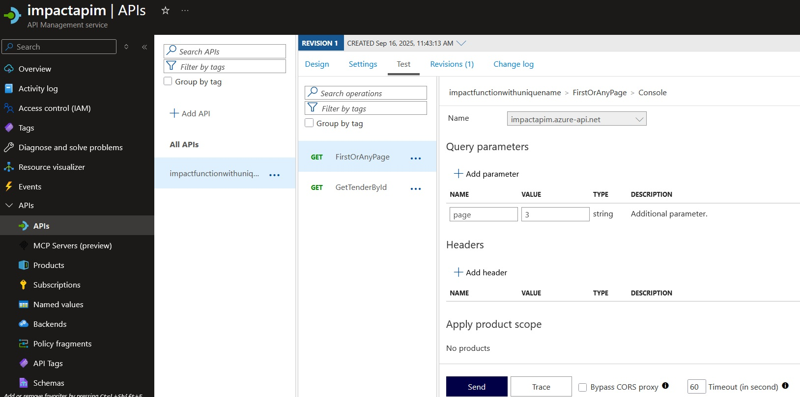
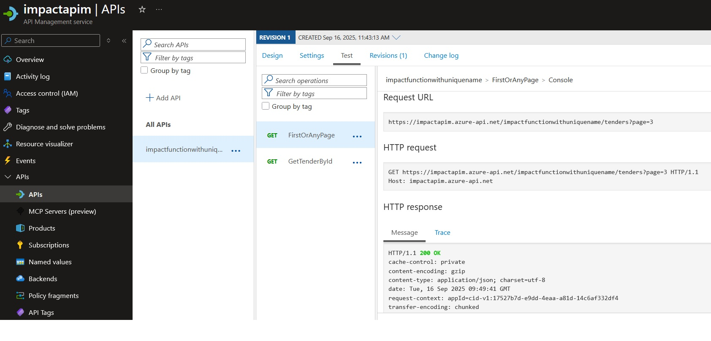

# IMPACT
IMPACT TENDERS REST API

# Features

- CICD
- Minimized costs
- Easy to validate/test/work locally
- Cache
- Pagination
- Cross pages ID search

# Response specs

### Local test & response fields: http://localhost:7053/api/tenders/585088
```
{
	"id": 585088,
	"date": "2022-11-23",
	"title": "Dostawa sprzętu medycznego dla potrzeb Uzdrowiska Goczałkowice - Zdrój Sp. z o.o. z siedzibą w Goczałkowicach - Zdroju",
	"description": "W zakres zamówienia wchodzi kolumna wolnostojąca do progresywnego treningu oporowego dla rehabilitacji pourazowej – 1 szt.",
	"awarded_value_eur": "26679.84",
	"awarded": [
		{
			"date": "2023-01-26",
			"suppliers_id": "1325",
			"suppliers": [
				{
					"id": "1325",
					"name": "HAS-MED Sp. z o.o."
				}
			]
		},
		{
			"date": "2023-01-26",
			"suppliers_id": "63",
			"suppliers": [
				{
					"id": "63",
					"name": "ZARYS International Group Sp. z o.o. Sp. K."
				}
			]
		},
		{
			"date": "2023-01-26",
			"suppliers_id": "8480",
			"suppliers": [
				{
					"id": "8480",
					"name": "F.H.U. Euro-Medical Maciej Świda"
				}
			]
		}
	]
}
```

### OpenAPI specs:
```
openapi: 3.0.1
info:
  title: impactfunctionwithuniquename
  description: Import from "impactfunctionwithuniquename" Function App
  version: '1.0'
servers:
  - url: https://impactapim.azure-api.net/impactfunctionwithuniquename
paths:
  '/tenders/{id}':
    get:
      summary: GetTenderById
      operationId: get-gettenderbyid
      parameters:
        - name: id
          in: path
          required: true
          schema:
            type: ''
      responses:
        '200':
          description: ''
  /tenders:
    get:
      summary: FirstOrAnyPage
      operationId: get-firstoranypage
      responses:
        '200':
          description: ''
components:
  securitySchemes:
    apiKeyHeader:
      type: apiKey
      name: Ocp-Apim-Subscription-Key
      in: header
    apiKeyQuery:
      type: apiKey
      name: subscription-key
      in: query
security:
  - apiKeyHeader: [ ]
  - apiKeyQuery: [ ]
```

# Azure Infra






